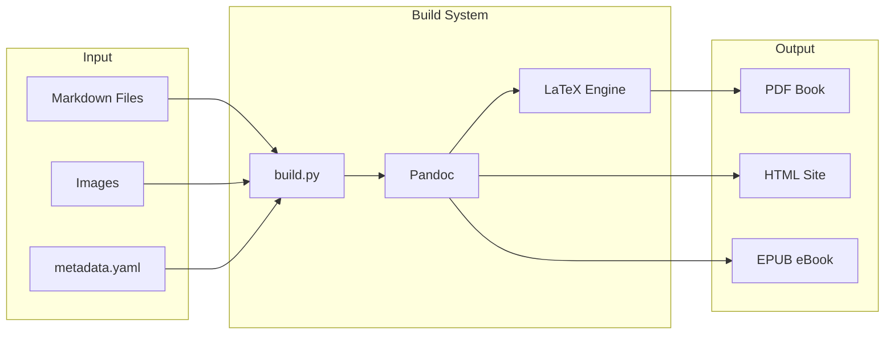

# Book Build Workflow with Pandoc

## Architecture Overview




## Tool Stack

| Tool | Purpose |

|------|---------|

| **Pandoc** | Core conversion engine (md to pdf/html/epub) |

| **pypandoc** | Python wrapper for Pandoc |

| **LaTeX (TeX Live)** | PDF rendering with professional typography |

| **Eisvogel template** | Beautiful LaTeX PDF template for technical books |

| **Pygments** | Syntax highlighting for code blocks |

## Files to Create

### In the docs submodule (`VizEngine/docs/vis-psyche-docs/`)

1. **`build/build.py`** - Main build script

- Combines all chapters in order
- Runs Pandoc with appropriate flags
- Outputs to `dist/` folder

2. **`build/metadata.yaml`** - Book metadata

- Title, author, date, description
- LaTeX settings (fonts, margins, colors)
- Cover image path

3. **`build/templates/eisvogel.latex`** - PDF template

- Professional book styling
- Custom title page
- Table of contents styling

4. **`build/templates/style.css`** - HTML/EPUB styling

- Code block themes
- Typography settings

5. **`build/requirements.txt`** - Python dependencies

- pypandoc
- PyYAML

6. **`.github/workflows/build-book.yml`** - GitHub Actions

- Triggered on push to docs repo
- Builds all formats
- Uploads artifacts / creates releases

## Build Script Features

```python
# build.py will support:
python build.py pdf      # Build PDF only
python build.py html     # Build HTML only  
python build.py epub     # Build EPUB only
python build.py all      # Build all formats
python build.py clean    # Remove dist/
```


## Output Structure

```javascript
dist/
├── vizpsyche-book.pdf      # Professional PDF with ToC
├── vizpsyche-book.epub     # eBook format
└── html/
    ├── index.html          # Single-page HTML
    └── images/             # Copied images
```


## Sample metadata.yaml

```yaml
title: "VizPsyche Engine"
subtitle: "Building a 3D Rendering Engine from Scratch"
author: "Your Name"
date: "2025"
lang: en
titlepage: true
titlepage-color: "1a1a2e"
titlepage-text-color: "eaeaea"
titlepage-rule-color: "e94560"
toc: true
toc-depth: 2
code-block-font-size: \scriptsize
highlight-style: monokai
```


## Dependencies to Install

1. **Pandoc** - `choco install pandoc` (Windows) or download from pandoc.org
2. **TeX Live** - `choco install texlive` or MiKTeX for Windows
3. **Python packages** - `pip install pypandoc pyyaml`

## Implementation Steps

1. Create `build/` directory structure in docs repo
2. Create `metadata.yaml` with book settings
3. Download Eisvogel template (MIT licensed)
4. Create `build.py` with chapter ordering and Pandoc invocation
5. Create CSS for HTML/EPUB styling
6. Create GitHub Actions workflow
